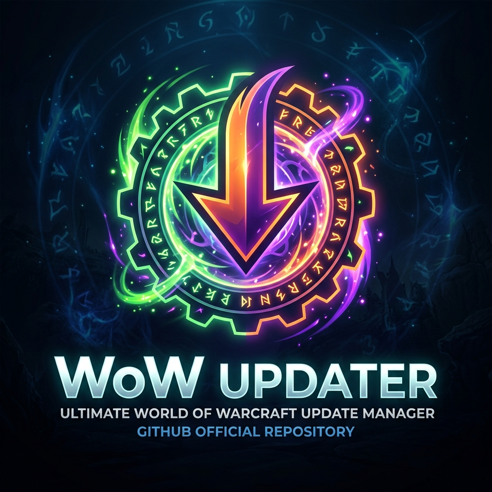

<div align="center">
  

  # ⚔️ WoW Updater

  **Ультимативный менеджер аддонов для World of Warcraft (CurseForge API)**
  
  [](https://www.python.org)
  [](https://opensource.org/licenses/MIT)
  [](https://github.com/TomSchimansky/CustomTkinter)
  [](https://github.com/paul2877/WoW-Updater/releases)

  *Легко. Быстро. Без лишнего мусора.*
</div>

---

## 🌟 Особенности

- 🔍 **Умный поиск** — Ищите новые аддоны по базе CurseForge прямо в программе.
- ⚡ **Молниеносное обновление** — Обновляйте все установленные аддоны одним кликом.
- 🔄 **Откат версий (Downgrade)** — Легко переключайтесь на старые стабильные релизы, если новый аддон сломался (актуально для пиратских серверов и кастомных патчей!).
- 📂 **Система профилей** — Создавайте отдельные профили сборок (например, "Для Рейдов", "Для PvP").
- 🤝 **Импорт и Экспорт** — Делитесь своими идеальными сборками с друзьями. Программа сама установит нужные аддоны по списку!
- 🛡️ **Локальное сканирование** — Программа автоматически найдет ваши текущие аддоны и возьмет их под своё крыло.

---

## 🚀 Установка и запуск

Вам **не нужно** уметь программировать или устанавливать Python! Программа скомпилирована в удобный `exe` файл.

1. Перейдите в раздел **[Releases](https://github.com/paul2877/WoW-Updater/releases)**.
2. Скачайте последний файл `WoW_Updater.exe`.
3. Запустите его (можно положить прямо на рабочий стол).
4. При первом запуске нажмите на **шестеренку ⚙️ (Настройки)** и укажите:
   - Папку с вашей игрой (путь до `...\_retail_\Interface\AddOns`).
   - Игровой патч (например, `11.0.5`).
   - Ваш бесплатный API ключ от CurseForge.

---

## 🛠 Устранение неполадок (LUA-ошибки / Аддон бастует)

Иногда бывает так, что разработчики (например, авторы **WeakAuras** или **Details!**) выпускают новую версию под грядущий патч, и эта версия намертво ломает вашу игру (выдает ошибки вида `GetSpecialization (a nil value)`).

В WoW Updater встроена **система отката версий**, которая спасет вашу сборку:

1. Откройте вкладку "Установленные" в WoW Updater.
2. Найдите сломанный аддон (например, `WeakAuras`).
3. Нажмите синюю кнопку **[Версии]**.
4. Пролистайте список вниз и найдите предыдущую стабильную версию (игнорируйте сборки Alpha/Beta). Нажмите **Установить**.
5. ❗ **САМОЕ ВАЖНОЕ:** После установки обязательно разверните игру и пропишите в чат команду:
   ```text
   /reload
   ```
   *Без этой команды игра не увидит изменения и продолжит выдавать ошибку!*

> **Совет:** Если после отката версии аддон спрашивает "Восстановить резервную копию?" — смело соглашайтесь. Это спасет ваши настройки.

---

<div align="center">
  <i>Разработано с ❤️ для сообщества World of Warcraft.</i><br>
  <code>paul2877 / WoW-Updater</code>
</div>
